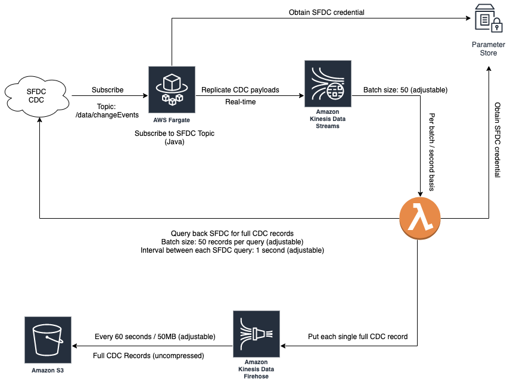

# Use case:

The Change Data Capture (CDC) occurred to any SFDC object needs to be replicated in DaaS platform.

The payload received from SFDC CDC event bus only contains changed fields, it is required to have the full record of the changed object to be received at DaaS side.

The solution should provide functions include:

- Subscribe to CDC event bus from SFDC
- Receive SFDC CDC Payload, this payload includes:
    - creation of a new record
    - updates to an existing record
    - deletion of a record
    - undeletion of a record (this is TBD)

- After received CDC payload, the solution should provide full payload including
    - operations: INSERT/UPDATE/DELETE
    - All values of All fields of the record

- The full payload should then placed to a landing bucket for DaaS platform to pick up as data ingest

The solution should provide a controllable way to query SFDC under considerations of 

- frequency of query sending
- complexity of a query
- amount of data to be pulled out of SFDC

## Scenarios:

- One object is changed in SFDC

    - This should result a full data (all values of all fields) of the record to be placed in DaaS with one of values in “INSERT/UPDATE/DELETE”

- Multiple objects are changed in SFDC

    - This should result several records to be placed in DaaS
    - Each record should contain all values of all fields plus one of values in “INSERT/UPDATE/DELETE”

----

# Architecture




----

# Deployment guide

## Requirements:

* [Docker Desktop](https://www.docker.com/products/docker-desktop) - Required to build docker image locally before pushing to a repo
* [Maven v3.6.3+](https://maven.apache.org/) - Required to build JAR as executable file
* [SAM CLI v0.41.0+](https://docs.aws.amazon.com/serverless-application-model/latest/developerguide/serverless-sam-cli-install.html) - To package/deploy SAM apps.
* [AWS CLI v1.18.0+](https://docs.aws.amazon.com/cli/latest/userguide/cli-chap-install.html) - To create resources in your AWS account.


### Initial credentials in `AWS SSM Parameter Store`
```
export SANDBOX_UNAME="YOUR_SANDBOX_USERNAME"
export SANDBOX_PWORD="YOUR_SANDBOX_PASSWORD"
export SANDBOX_DOMAIN="test"
export SANDBOX_ACTIVE="0"
export SANDBOX_SECURITY_TOKEN="YOUR_SANDBOX_SECURITY_TOKEN"

export UNAME="SFDC_USERNAME"
export PWORD="SFDC_PASSWORD"
export SECURITY_TOKEN="SFDC_SECURITY_TOKEN"

export AWS_ACCOUNT_ID="YOUR_AWS_ACCOUNT_ID"
export AWS_DEFAULT_REGION="YOUR_TARGET_REGION"

aws ssm put-parameter \
    --name "/sfdc/sandbox/active" \
    --type "String" \
    --value $SANDBOX_ACTIVE \
    --overwrite

    
aws ssm put-parameter \
    --name "/sfdc/sandbox/domain" \
    --type "String" \
    --value $SANDBOX_DOMAIN \
    --overwrite

aws ssm put-parameter \
    --name "/sfdc/sandbox/username" \
    --type "SecureString" \
    --value $SANDBOX_UNAME \
    --overwrite

aws ssm put-parameter \
    --name "/sfdc/sandbox/password" \
    --type "SecureString" \
    --value $SANDBOX_PWORD \
    --overwrite
    
aws ssm put-parameter \
    --name "/sfdc/sandbox/security_token" \
    --type "SecureString" \
    --value $SANDBOX_SECURITY_TOKEN \
    --overwrite

aws ssm put-parameter \
    --name "/sfdc/username" \
    --type "SecureString" \
    --value $UNAME \
    --overwrite

aws ssm put-parameter \
    --name "/sfdc/password" \
    --type "SecureString" \
    --value $PWORD \
    --overwrite

aws ssm put-parameter \
    --name "/sfdc/security_token" \
    --type "SecureString" \
    --value $SECURITY_TOKEN \
    --overwrite
```

### Deploy `Subscriber`

```
export DOCKER_IMAGE_NAME="sfdc-cdc-aws-sub"

export STACK_NAME="sfdc-cdc-aws"

cd subscriber/app

mvn clean package

docker build -t $DOCKER_IMAGE_NAME .

aws ecr get-login-password | docker login --username AWS --password-stdin $AWS_ACCOUNT_ID.dkr.ecr.$AWS_DEFAULT_REGION.amazonaws.com/$DOCKER_IMAGE_NAME

docker tag $DOCKER_IMAGE_NAME:latest $AWS_ACCOUNT_ID.dkr.ecr.$AWS_DEFAULT_REGION.amazonaws.com/$DOCKER_IMAGE_NAME:latest

docker push $AWS_ACCOUNT_ID.dkr.ecr.$AWS_DEFAULT_REGION.amazonaws.com/$DOCKER_IMAGE_NAME:latest

cd ../

aws cloudformation deploy --stack-name $STACK_NAME-vpc --parameter-overrides EnvironmentName=$STACK_NAME --template-file ./cloudformation/vpc.yaml --capabilities CAPABILITY_IAM

aws cloudformation deploy --stack-name $STACK_NAME-subscriber --parameter-overrides VPCStackName="$STACK_NAME-vpc" DockerImageUrl="$AWS_ACCOUNT_ID.dkr.ecr.$AWS_DEFAULT_REGION.amazonaws.com/$DOCKER_IMAGE_NAME:latest" --template-file ./cloudformation/subscriber.yaml --capabilities CAPABILITY_IAM

cd ../

```

### Deploy `Worker`

```
cd worker

export SAM_BACKET_NAME="$STACK_NAME-$AWS_DEFAULT_REGION-sam"
export TARGET_BUCKET_NAME="YOUR_TARGET_S3_BUCKET_NAME"

aws s3 mb s3://$SAM_BACKET_NAME

sam build

sam package --s3-bucket $SAM_BACKET_NAME --output-template-file packaged.yaml 

aws cloudformation deploy --stack-name $STACK_NAME-worker --parameter-overrides SFDCSubscriberStack="$STACK_NAME-subscriber" TargetS3BucketName="TARGET_BUCKET_NAME" --template-file ./packaged.yaml --capabilities CAPABILITY_IAM
```

----

# Further development (TODO):

- Review code in worker and make best usage of SFDC APIs when query full CDC record

- Review code in subscriber and make best usage of SFDC APIs when subscribing to a topic

    - *Consider using “OAUTH token” for SFDC authentication instead of using username + password + security_token
        - *This is to be determined since even using OAUTH token there still needs a facility for app to Authenticate itself with the IdP, so a credential in static might be always required

- Performance test with bulk changes in SFDC and adjust BATCH SIZE and INTERVAL of worker for an acceptable frequency accessing SFDC API using SOQL


- Test and see if any chance worker could **not** finish the work within 15 minutes (Maximum timeout of one Lambda invocation)


- Test and see if SFDC could block requests when querying for full CDC records

- Build CI/CD pipelines for worker and subscriber

- For Subscriber, consider whether to put mvn clean package as part of Dockerfile however this will increase file size of the image/container at running